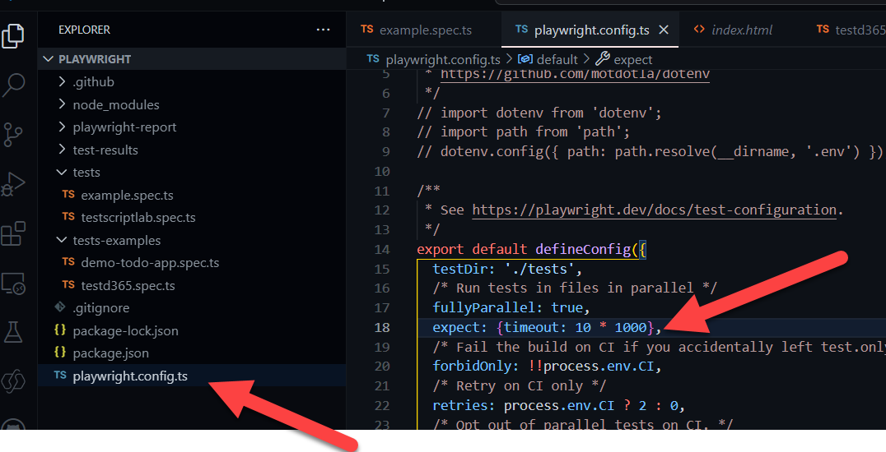
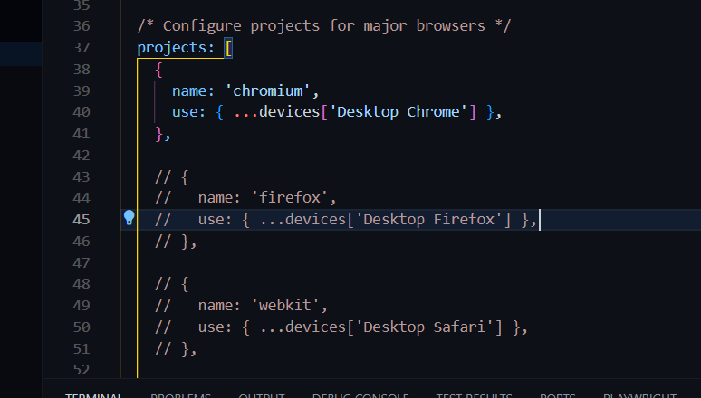
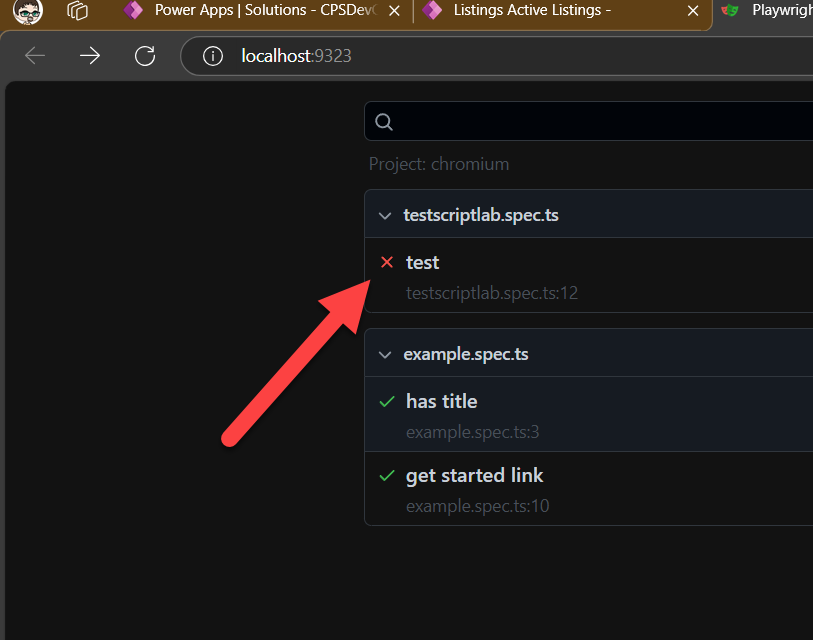
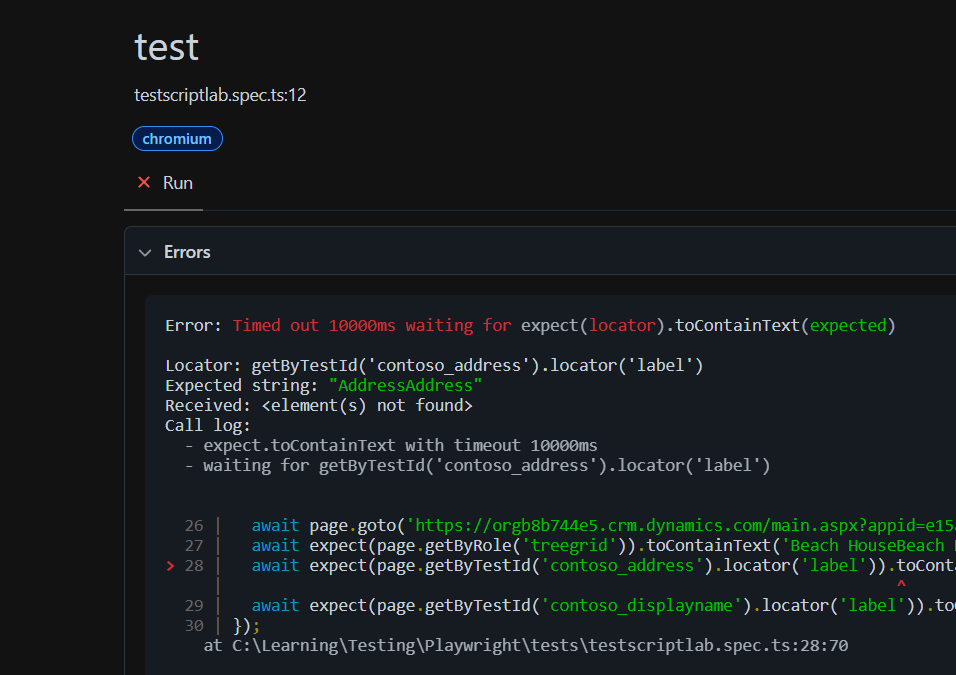

# Intro

Automated testing is a vital component for larger projects, where multiple developers are creating solutions in multiple streams, ensuring quality and essentially not breaking what has gone before adds a confidence in the delivery process.

Triggering automated test scripts as part of the build process reduces manual efforts and greatly reduces the impact of change to projects of any size.

Power Apps comes with the Power Apps Test Studio, but it is limited (currently) to testing Canvas Apps. This is a great starting point if you are only worried about canvas apps.

Playwright is an open source framework, created by Microsoft to allow testing across multiple browsers and websites, and will work for Model Driven apps, first party apps (such as Customer Service and Field Service), Canvas Apps and Power Pages. It is ideal if your solution spans multiple parts of the platform.

## Using Power Apps Test Studio

1. Create a test script in Test Studio

## Using Playwright

### 1. Install Playwright

1. Open the Extensions Window (Ctrl + Shift + X)

2. Search for Playwright and select Playwright Test for VSCode

3. Withing VSCode create a new Window (Ctrl + Shift + N) and create a new folder (Ctrl + K, Ctrl + O) called TestScripts

4. Install the Playwright Extension for VSCode

 

5. Once installed, open Commands (Ctrl + Shift + P) and type Test and run the command Test>: Install Playwright

 

6. In the menu, select all 3 browsers, leave Use Javascript blank (we want to use the default Typescript) and add the Github Actions workflow checkbox filled


7. This will create a sample test script in your new folder and allow you to run the sample test scripts.

````npm
 npx playwright run
 ````

 This should run 6 tests using 6 workers as defined in the example.spec.ts file

 

 8. Once returned, take a look at the results

 ```npx
 npx playwright show-report
 ```

 This will display a webpage with the results for you to dissect.

 

### 2. Configure MFA for Playwright

For the Power Platform, you usually log in and use Multi-factor Authentication (MFA) to secure your account, and this is becoming the default. As Playwright can not interact with your secondary device, the authenticator app on your phone, we have to do a little work around (suitable for POC, but for your real-life projects, you should use a dedicated test account, with very limited access to your dev system)

For our lab, we will be adding a Timed One Time Passcode method, which will mimic getting a code from your authenticator.

1. Navigate to <https://mysignins.microsoft.com/security-info> in the browser you have been connecting to Power Platform with.

2. Select the Add sign-in method button.

3. Choose Microsoft Authenticator

4. Select 'I want to use a different authenticator app'

5. Select Next

6. Select Can't scan image

7. Copy and keep safe the Secret Key, you will need this later.


8. Open your authenticator app on your phone and scan the QR code.

9. Click Next

10. Enter the code from your authenticator app and click Next.

This should now appear as another authenticator in your list.

> [!WARNING]
> Enusre you remove this authenticator when you are done. Whilst you need the secret, it should not be an option.

> {!TIP] All these secrets and passwords are passed as plain text in our lab, in a production and alm scenarios, these will be kept within a key vault to ensure they are not shared.

### Create a starter Test Script

To enable automated testing, you need to tell Playwright what to do and what to check once you have done it.

Playwight can create scripts from your actions in a browser and we will use this technique to firstly authenticate then expand to ensure what we test is accurate.

1. Open the recording harness with your org

```npm
npx playwright codegen https://<your org>.crmXX.dynamics.com
```

This should open up a chromium (Not Chrome or Safari etc) browser with a log in box


As you move your cursor around, the selection items are highlighted and the Playwright inspector shows you what it wants to do.

2. Enter your Email and hit next

3. Enter your password and select Sign in

4. This should present you with the standard Approve Sign in Request box.

5. Select the 'I can't use my Microsoft Authenticator app right now'


6. Select Use a verification code

7. In your authenicator app, select the profile for your app you created earlier(you will have a popup for the normal route, but ignore that) and enter the code that is displayed, then choose Verify

8. Select Yes on the 'Stay Signed in?' Page

9. You should be presented with the App selector screen, lets go to the Contoso Real Estate Admin app we imported.

10. Select the first listing to go to the record (It depends on what records you created in the pre-requisites stages on what you see here)


So this should mean we are in a listing record. Let us check we are getting the results we expect by asserting (Testing term for making sure) a few things.

Select the Assert Text button then the first listing (This should be Beach House if you have imported the data from the pre-requisites)


Ensure you select the Accept tick.

11. Repeat this action to assert the Address and Display Name columns are going to be there.

12. Take a look at the Playwright Inspector window, it should be very similar to mine below.

> {!TIP] If you see Enter options in your field entries, ensure you remove them. We have a happy of just pressing enter when entering passwords and other information, which works great when Playwright runs the test, but can be hit and miss when you are walking through the test scripts.


### Automate login using a generated code

To automate this script, so it runs everytime, on every browser without interaction, we need to tweak the code entry to ensure it uses that which we generated.

1. Copy the code in the Playwright Inspector Window.

2. Create a new file in your VS Code Tests folder and call it testscriptlab.spec.ts

Paste your code into that box.


At the top of the code, below the first line copy the following code

````ts
import * as OTPAuth from 'otpauth';

let totp = new OTPAuth.TOTP({
    issuer: "Microsoft",
    algorithm: "SHA1",
    digits: 6,
    period: 30,
    secret: "<your secret>",
  })

````

Ensure you replace your secret above with the secret key you generated in step 2.7 above.

This code is a small method that creates that 6 digit number for you. The code is a timestamp and secret combination, so if you know the secret, you can generate the code. This is used throughout the MFA world and is industry standard.

3. Find the line in your code where your script enters the code, it should look like 

````ts
  await page.getByRole('textbox', { name: 'Enter code' }).fill('577642');
````
Change this line to be
````ts
    await page.getByRole('textbox', { name: 'Enter code' }).fill(totp.generate());
````

This will use your secret and create a code and replicate you entering a code. 

4. Finally, Playwright is not as forgiving on loading as Power Platform is, so we need to just tweak the time outs for the expect action (when something is asserted or expected to be there to twice the normal)

Find the playwright.config.ts file in your top level directory, and add the line below the fullyParrallel line

````ts
  expect: {timeout: 10 * 1000},
````



> {!TIP] If you are struggling with getting your tests running, disabling one or more of the projects (the browser bases that your tests run on) a little further down by commenting out the Safari entry for example



5. Make sure all your files are saved (Ctrl + K, S) and re-run your test by running in the terminal the test command

````npm
 npx playwright run
 ````

 Hopefully everything works and you get a positive result!

### Change your solution and run the script
As you are testing to ensure a solution always contains certain things, in our instance, we have a view with 2 columns, Address and Display Name, To make the test fail, edit the view and retest. 
1. go and tweak the Active Listings View to remove the Address column. 

2. Save and Publish the view.

3. Check in your application the address view is no longer present.

4. Re-run the test in Playwright

You should get a failure and the report is automatically displayed


Click on the Red item to see what failed, in our case, the Address field is not present.



5. Add the address field back and re-run your test to prove you have now fixed your test.

### Configuring DevOps

The ideal scenario is for when a dev pushes their code into a test environment, a suite of tests are run against it, built up from what the testers and users deemed as being important. This suite will build over time to include aspects that are not changed over time but may be inadvertently changed (fields in view, fields on forms, calculations etc etc.)

Let us know look how to add our Playwright test script to ADO.


