# Prerequisites

To enable a smooth lab experience, we require you to have completed some pre-workshop activities.

## Set Up three Developer Environments for the Power Platform ALM Workshop

### Sign Up for Developer Environments  

#### Option 1: No Work/School Account (Sandbox Tenant)  
If you **don't have a work/school account** or prefer a **Sandbox tenant** to explore Power Platform:  
1. **[Create a test tenant](https://learn.microsoft.com/en-us/power-platform/developer/create-developer-environment#how-to-create-a-test-tenant)**.  
2. Sign up for the [Power Apps Developer Plan](https://developer.microsoft.com/en-us/power-platform).  

#### Option 2: Using a Work/School Account  
If you **already have a work/school account** and want to use it for learning Power Platform, proceed to the next section.  

---

## Creating and Accessing Developer Environments

### Steps to Create Developer Environments (DEV, UAT, and PROD)

1. **Login** to [Power Platform Admin Center](https://admin.powerplatform.microsoft.com/) using your Microsoft account.
2. Ensure **New admin center toggle** is turned on.
3. Navigate to **Manage → Environments → New**.
 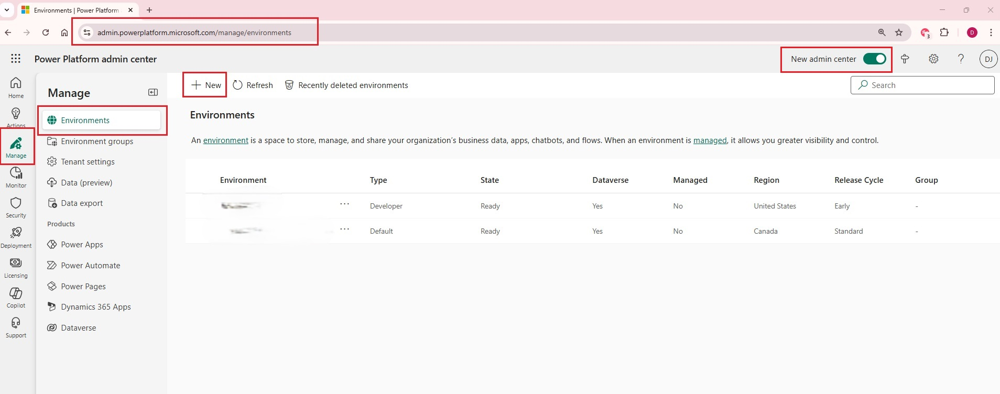
4. Use the following settings to create three environments: DEV, UAT, and PROD.

| Setting                     | DEV         | UAT         | PROD        |
|-----------------------------|------------|------------|------------|
| **Name**                    | CPPS DEV   | CPPS UAT   | CPPS PROD  |
| **Make this a managed environment** | No | Yes | Yes |
| **Group**                   | None       | None       | None       |
| **Region**                  | Canada     | Canada     | Canada     |
| **Get new features**        | No         | No         | No         |
| **Type**                    | Developer  | Developer  | Developer  |
| **Purpose**                 | Source environment for CPPS 2025 ALM workshop | Target environment for CPPS 2025 ALM workshop | Target environment for CPPS 2025 ALM workshop |
| **Add a Dataverse data store** | Yes | Yes | Yes |
| **Pay-as-you-go with Azure** | No | No | No |
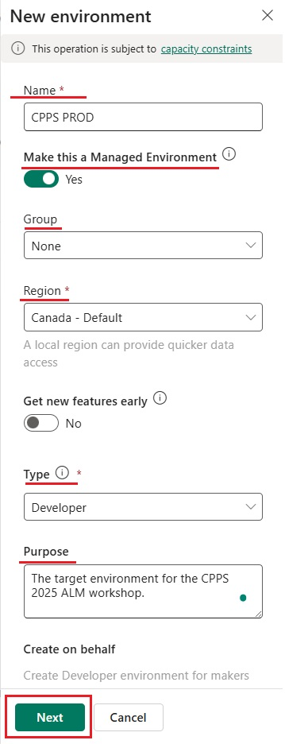
5. Click **Save** to create the new environment.
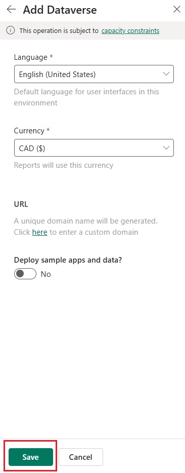
6. Repeat steps **1-5** for all three environments: **DEV, UAT, and PROD**.
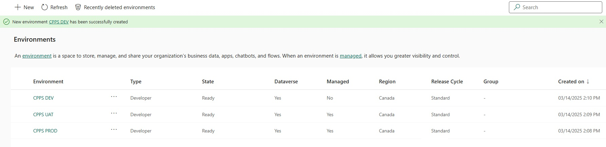

---

## Notes

- Ensure all environments follow the same settings for consistency.
- The **DEV** environment is the source for the CPPS 2025 ALM workshop.
- The **UAT** and **PROD** environments are the target environments for testing and deployment.
- Depending on your employer, you may have the environments already, but the environments do need to be separate to your current environments to prevent inadvertent moving of solutions around and corruption
- Microsoft provides all users the ability to have 3 developer environments which are perfect for our lab.

## Create Azure DevOps

For Azure DevOps use the same Microsoft account which you used to create your Developer environments. If you already have an Azure DevOps organization you can skip part 1 and directly create a new project in your existing organization.

### Create Azure DevOps organization

 1. As a first step we need an Azure subscription, you can either use an existing one or sign up for the free Azure subscription here which will additionally give you $200 for 30 days (not needed for this lab): <https://azure.microsoft.com/en-in/pricing/purchase-options/azure-account>
 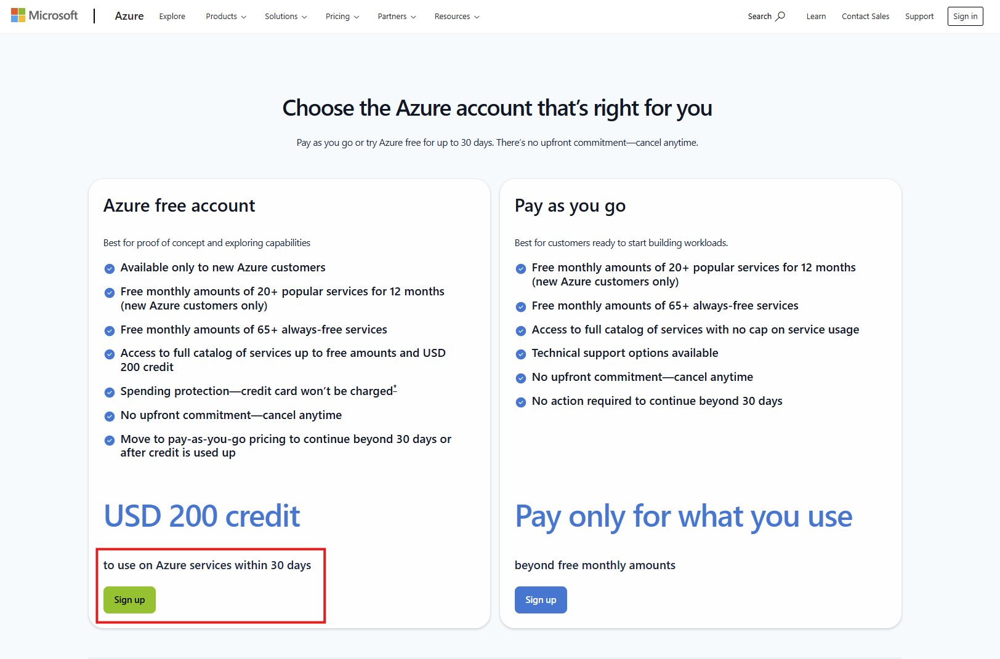
 2. Fill out the sign up form, you will need a credit card for authentication but Microsoft will not charge you unless you change the subscription to pay-as-you-go after your credits are used. Azure DevOps will not consume any credits.
 3. After your account is created go to <https://portal.azure.com/> and log in. Afterwards search for "Azure DevOps" in the global search and select "Azure DevOps organizations".
 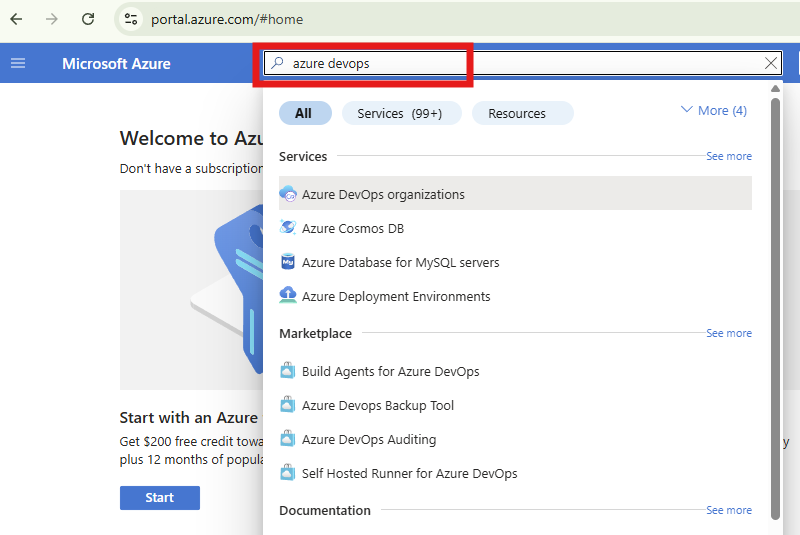
 4. Click on "My Azure DevOps Organizations", fill out the form with your details and click on "Continue".
 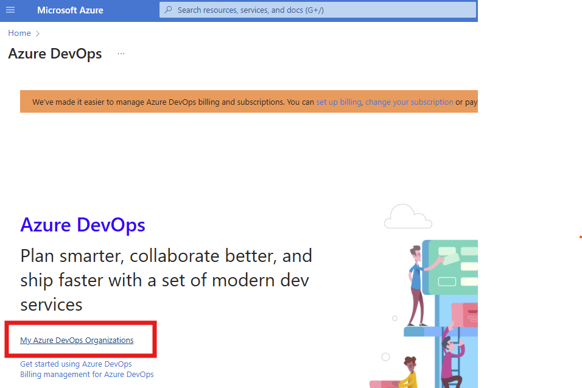
 5. In the Azure DevOps portal click on "Create new organization", and give it a name on the next screen
 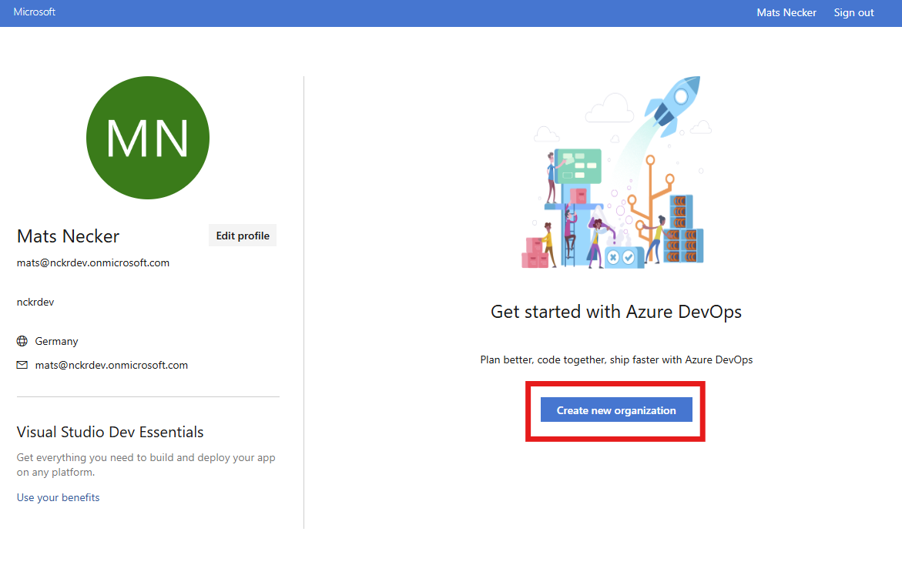
 6. Once your organization is created you are directed to a screen to create a new project. Give it a name and click on "Create project"
 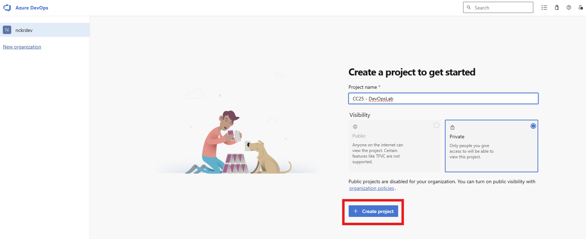

 Congrats on creating your Azure DevOps organization and project for the lab! 🥳

## Install VS Code

VS Code is a code editor provided by Microsoft which we will use to complete some automated testing.

1. Navigate to <https://code.visualstudio.com/download> and download and install VSCode version appropriate for your machine.

## Import a sample solution and data

To accommodate our lab, we will re-use a solution that has been prepared for you. This will be set up in your Developer environment and moved through the environments by the pipelines you create in the lab.

1. Download the unmanaged solution for a accommodation listing app from <https://linked365.blog/CPSDevOpsSolution_1_0_0_3.zip>
2. Download the data files from <https://linked365.blog/Listing_Files.zip> and extract the files into a folder.
3. Import the Solution in your Developer Environment

    1. Go to Make.powerapps.com and ensure the selected environment is your Developer Environment (1)

     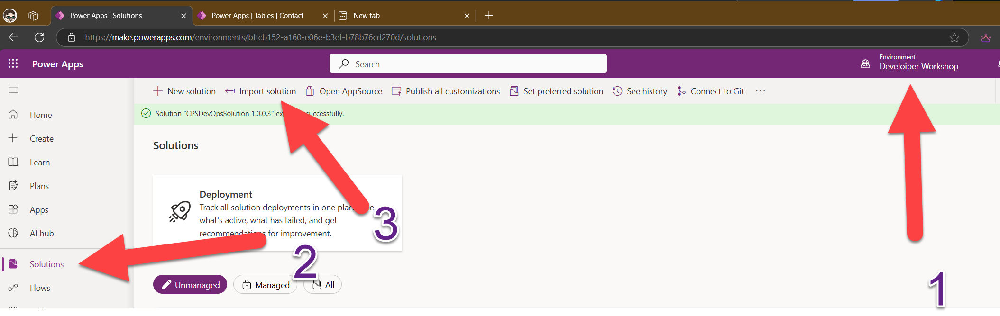

     2. Select Solutions (2) then Import Solution (3)

     3. Browse for the solution you downloaded and select Next

     4. Follow the messages selecting Next each time

     5. This should install the sample solution with 5 tables.

     6. In Solutions again, select the solution we just imported and ensure it plays

     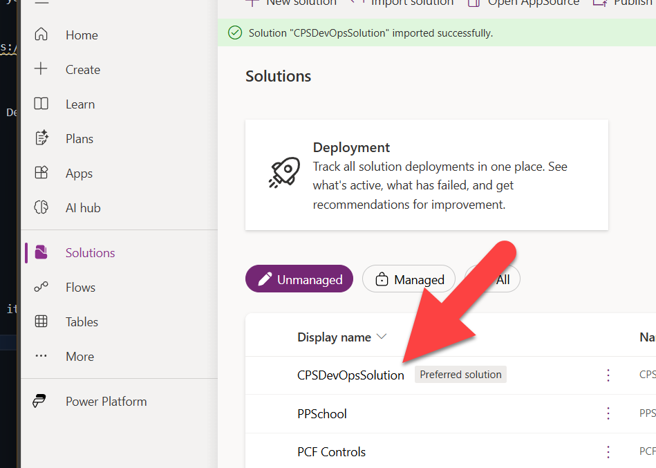

     Select the solution, then apps and the 3 dots next to the Contoso Real Estate Administration App and Play

     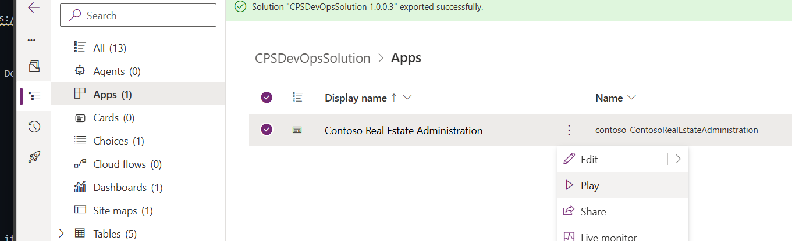

     The application should load (with no data)

### Import Sample Data

 1. Import some sample data

     Back in the solution, select Tables, Listing, The Import dropdown and select Import data from excel

     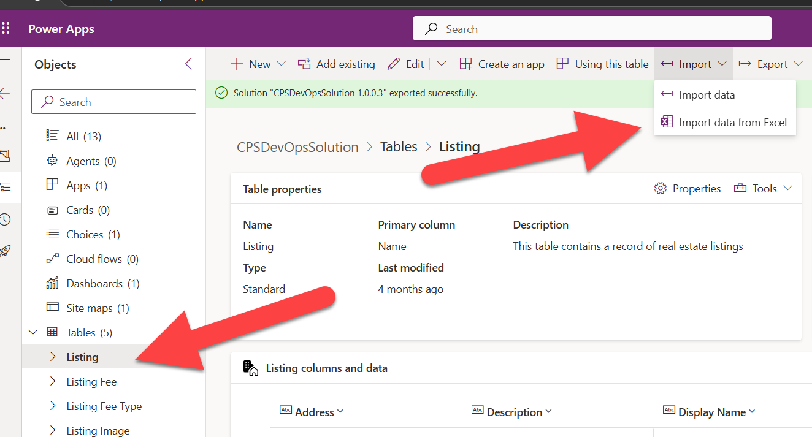

 2. Select the listings file extracted from the data files zip in step 2.

 3. Select Import

     Repeat the last 3 steps for the other files in the zip file and upload data (in this order) for

        1. contoso_listingimages
        2. contoso_listingfeetypes
        3. contoso_listingfees
        4. contacts

 4. Reopen the app from step 6 and you should see data being populated.
